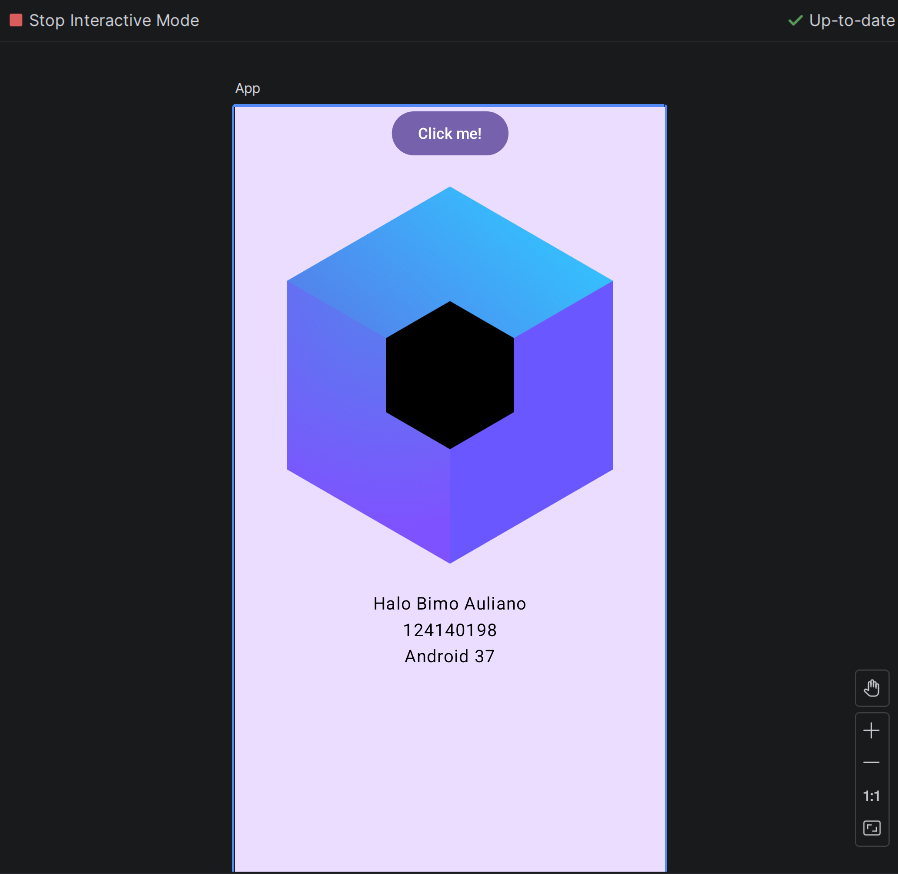
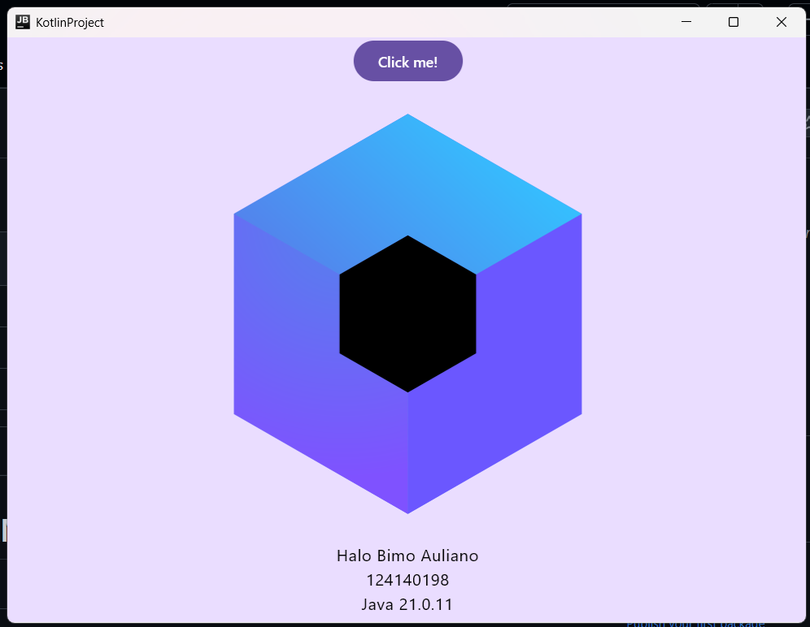
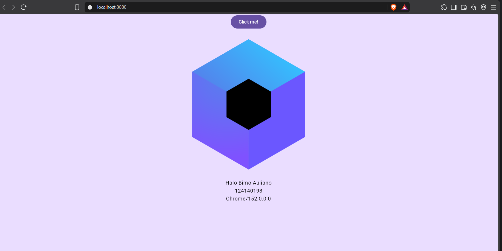

# TUGAS PAM RB

**Nama**: Bimo Auliano
**NIM** : 124140198 
**Kelas**: PAM RB

---

## Deskripsi
Tugas ini dibuat untuk mempelajari dasar pembuatan dan struktur proyek program sederhana yang meliputi nama & nim. Di berbagai platform, meliputi Android, Desktop, Mobile App, dan Web menggunakan Android Studio.